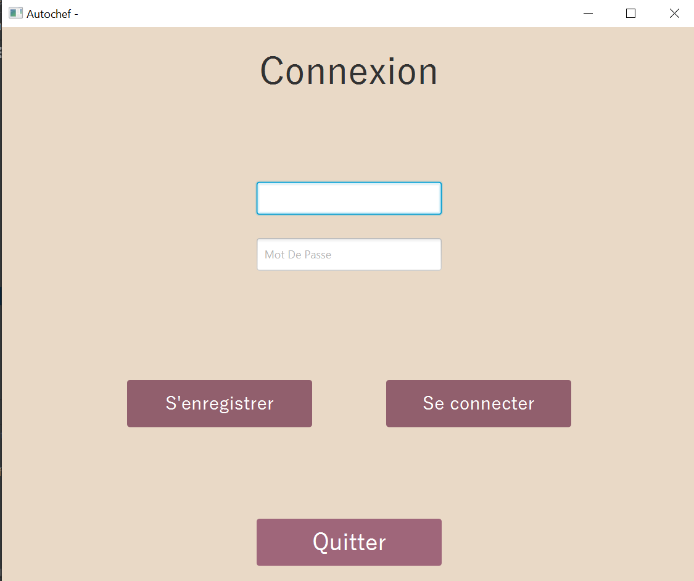
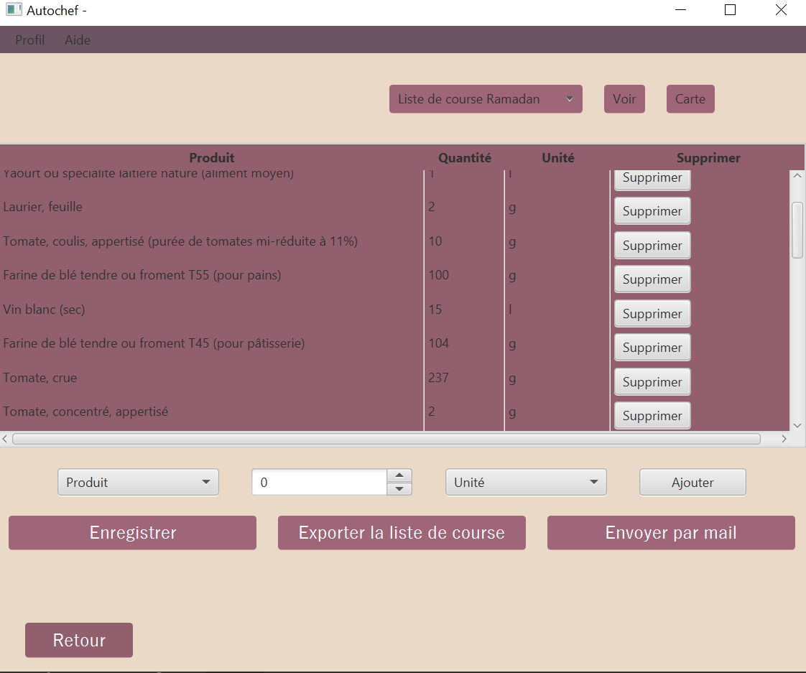
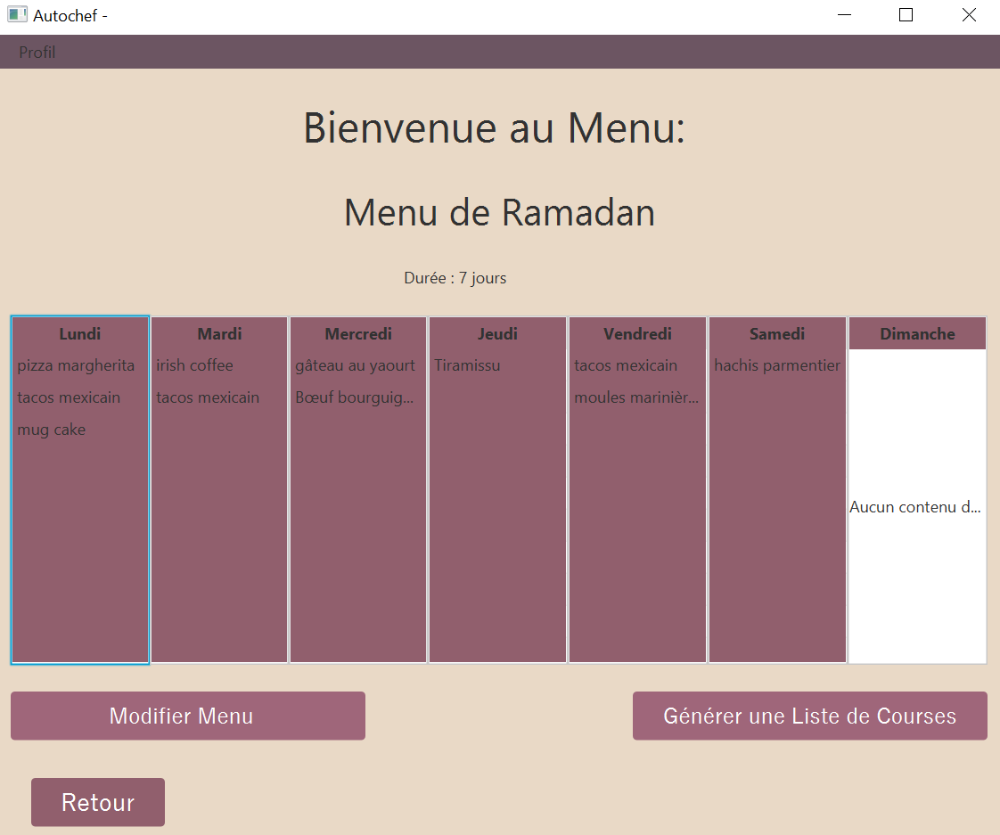
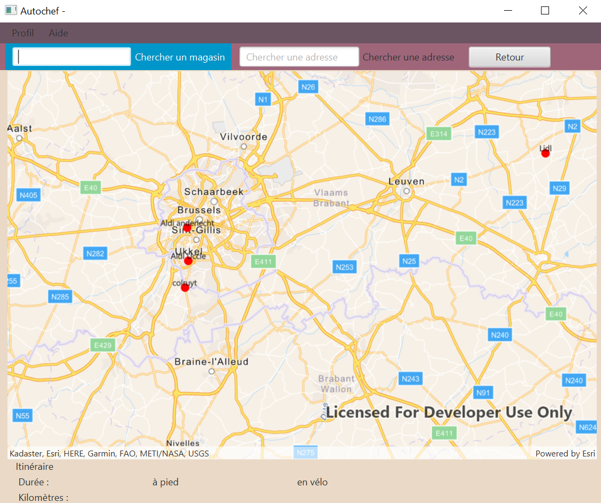
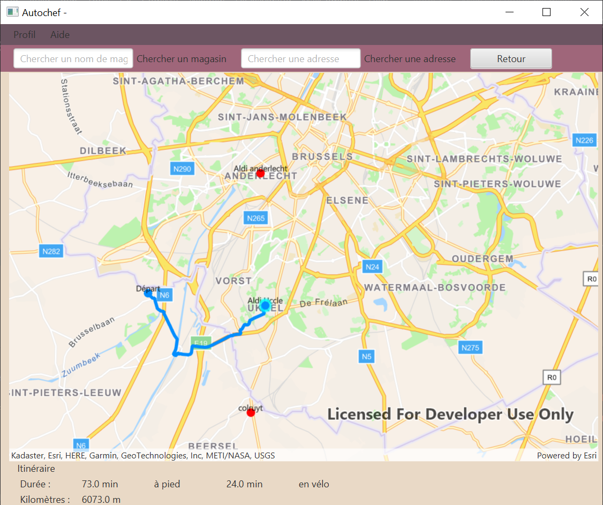

# Autochef : Project for the software engineering and project management course (INFO-F-307)

Project to create a desktop application to manage and organize shopping lists

---

## Compilation

On Linux:
`./gradlew shadowJar`

On Windows:
`./gradlew.bat shadowJar`

## Start
Retrieve the zip "iteration4.zip" in the ressource
Double-click on the jar file
OR `./gradlew runShadow` on Linux and MacOS  
`./gradlew.bat runShadow` on Windows

# Languages and Tools

   

## Screenshot

---
### French - Francais

---

# Autochef : Projet de génie logiciel et gestion de projet (INFO-F-307)

Projet visant à créer une application de bureau permettant la gestion et l'organisation des listes de courses.

# Utilisation

Java version 17.0.2

## Compilation

Sur Linux:
`./gradlew shadowJar`

sur Windows:
`./gradlew.bat shadowJar`
## Démarrage
Dézipper le zip "jnLibs"

Double-clic sur le fichier jar  
OU `java -jar g01-iteration-x.jar`

OU `./gradlew runShadow` sur Linux et MacOS  
`./gradlew.bat runShadow` sur Windows

# Misc

## Développement

## Screenshot

## License
